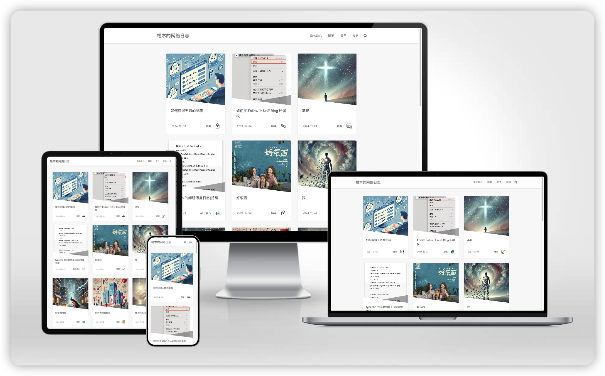

# PingRay



## 由来

本项目是作者为学习 next.js 的练手之作。原本使用的 blog 系统是 typecho + [pinghsu](https://github.com/chakhsu/pinghsu) 主题。博客部署在家中的 NAS 上，在经历了几次断电断网之后，起了将 blog 迁移到静态blog上的想法。又因为正在学习 next.js，于是就用next.js实现了一版。在设计上，本项目可以说是 [pinghsu](https://github.com/chakhsu/pinghsu) 的不完美复刻。

## 主题预览

[https://thedoga.tech/](https://thedoga.tech/)

## 特性

- [x] next.js + typescript 实现，可以直接在 vercel 部署
- [x] 纯静态实现，加载速度有保障
- [x] 支持 37 种语言代码高亮
- [x] 支持 Latex 公式
- [x] 支持 Mermaid 流程图
- [x] 移动端适配
- [x] SEO 友好
- [ ] 评论
- [ ] 搜索

## 使用

Fork 本项目，并 clone 到本地。

1. 在 posts 目录下添加文章

2. 预览

    ```bash
    npm install 
    npm run dev
    ```

    默认地址：[http://localhost:3000](http://localhost:3000)

3. 上线前测试

    ```bash
    npm run build 
    npm run start
    ```

默认地址同上

## 部署

按照 vercel 流程可以直接部署到 vercel。[参考文档](https://vercel.com/docs/getting-started-with-vercel/import)


## Contributing 贡献

All kinds of contributions (enhancements, new features, documentation & code improvements, issues & bugs reporting) are welcome.

欢迎各种形式的贡献，包括但不限于优化，添加功能，文档 & 代码的改进，问题和 bugs 的报告。

## License 许可证

Open sourced under the MIT license.

根据 MIT 许可证开源。
